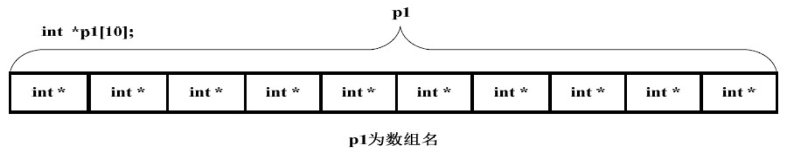
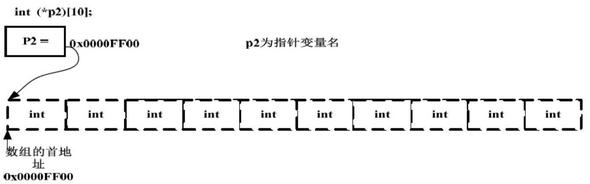
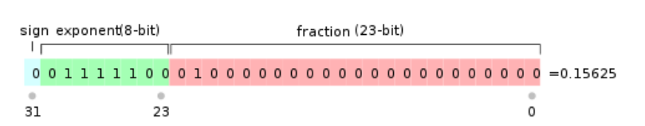

## 文件操作
#### 格式：
```c
FILE *in;
in=fopen(文件名,使用文件方式)
```
#### 使用文件方式（常见）：
   * r(只读):为了输入数据，打开一个存在的文本文件，如果打开文件不存在会出错
   * w(只写):为了输入数据，打开一个文本文件，如果打开文件不存在则会建立一个新文件
   * wb(只写):为了输入数据，打开一个二进制文件，如果打开文件不存在则会建立一个新文件
   * rb(只读):为了输入数据，打开一个二进制文件，如果打开文件不存在会出错
   * __注：处理除开文本文件的其他格式的文件需要用wb/rb__
#### 判断是否到文件尾的两种写法
   * 错误写法
```c
char c;
while(!feof(fp))
{
c = fgetc(fp);
printf("%X\n", c); 
}
```
   * feof（fp）用于测试fp所指向的文件的当前状态是否为“文件结束”。如果是，函数则返回的值是1（真），否则为0（假） 
   * 会发现多输出了一个FF，原因就是在读完最后一个字符后，fp->flag仍然没有被置为_IOEOF，而feof()仍然没有探测到文件结尾。
   * 再次调用fgetc()执行读操作，feof()才能探测到文件结尾。这样就多输出了一个-1(即FF)。
    
   * 正确写法
   ```c
   char c;
c = fgetc(fp);
while(!feof(fp))
{
printf("%X\n", c); 
c = fgetc(fp);
} 
   ```
   * 参考链接：[链接](https://blog.csdn.net/woaisia/article/details/46441449?utm_source=blogxgwz1)

----
## C语言控制台编程
#### 参数含义解析

* int main(int argc,char *argv[])

   * argc是命令行总的参数个数argv[]是argc个参数，其中第0个参数是程序的全名，以后的参数命令行后面跟的用户输入的参数
   * char* argv[]是一个指针数组，即数组的每个元素为一个指针，存储一个地址
   * argc与argv解释 [链接](https://blog.csdn.net/hopeneversleep/article/details/55798722)
#### 在命令行运行时注意事项
   * __只能在VS2017中进行生成解决方案，而不能直接运行（假设代码是在VS2017 IDE编写的）__
   * __且命令行指的是cmd打开的窗口，运行格式为:源文件名.exe 参数1 参数2 XXX 运行完成后必须退出（即在出现按任意键退出时，要按任意键）__
---
## 空指针与void\*类型指针
#### 空指针
* 通常说空指针是一个没有指向的指针，即为NULL，这个说法不是很准确，空指针其实也是有指向的指针，但它指向的地址是很小的地址，约定俗成地址为0，在stdio.h的头文件定义中NULL为#define NULL ((void*)0),这是一个宏定义，NULL实际是((void\*)0)，这是一个强制类型转换，转换成了void\*类型，本来void\*类型就是用来存放地址的，这里的0自然也就是地址0，在内存分配时，较小的地址是不用来存放数据的，也不允许程序访问，因此这个指针不能操作它指向的这块小的地址，简单来说，空指针其实有指向，但是它指向的地址是特殊的，该地址不允许存放数据和不允许程序访问，所以空指针不能操作该地址里的东西，我们也就理解成**“指针指向了空，无法操作了”**。
#### void\*类型指针
* 这个类型指针指向了实实在在的存放数据的地址，但是类型我们暂时不知道
* 一个例子
```C
char*str=(char*)malloc(sizeof(char)*13);
```
* malloc函数动态分配内存返回的所分配内存的首地址，但不知道该地址存放的内容是什么，此时类型为void\*，后来强制类型转换为char*,使得它可以存放我们想要的内容
----
## 数组指针与指针数组
* 概念上的区分：
  * 数组指针（也叫行指针）：指针是中心词，归根到底为指针，定义方式如**int (\*p)[10]**，加括号的原因是因为运算符优先级问题，()优先级高于[]，而\*优先级低于低于[]，注意：**int (\*p)[10]指向一个整型的一维数组，这个一维数组的长度是10，也可以说是p的步长，执行p+1时，p要跨过n个整型数据的长度**
  * 指针数组：归根到底是数组，与一般数组不同的是，它存储的元素是指针，而不是char、int等基本类型，定义方式如**int \*p[10]**，不用加括号，因为[]优先级本来就高于*
  * **优先级问题：() > [] > \***

* 内存划分

  * int  \*p1[10]
    * 
  * int (*p2)[10]
    * 

* int (*)[10] p2------也许应该这么定义数组指针

  * 平时定义指针都是在数据类型后面加上指针变量名，例如：int\* p; 按这个道理似乎定义数组指针的方法应该是int (\*)[10] p2; int (\*)[10]是指针类型，p2是指针变量，看起来似乎别扭，但是数组指针原型确实如此，只不过定义的时候还是钥用int (\*p2)[10]; 因为int (\*)[10] p2的定义方式只是我们方便理解，而编译器不这么想

* a与&a的区别

  * 代码一

  * ```C
    int main()
    {
        char a[5]={'A','B','C','D','E'};
        char (*p3)[5] = &a;
        char (*p4)[5] = a;
        return 0
    }
    /*
    分析：
    1.&a与a是什么鬼。。。其实我之前只用过a，表示数组首地址，其值与&a[0]相等，但是其实a表示的是数组首元素的地址，&a才表示的是整个数组的首地址，虽然数值相同，但是意义明显不同
    2.p3与p4毫无疑问都是数组指针，指向整个数组
    3.在Vs2017中，数组指针p3的"="两边的数据类型一致，但是p4两边的数据类型不一致，左边的类型是指向整个数组的指针，右边的数据类型是指向单个字符的指针。vs2017给出错误提示："char *" 类型的值不能用于初始化 "char (*)[5]" 类型的实体
    4.要使p4这条赋值语句正确，应该改为char (*p4)[5] = (char (*)[5])a;
    
    */
    
    ```

  * 代码2、代码3

  * ```c
    //代码2
    int main()
    {
        char a[5]={'A','B','C','D','E'};
        char (*p3)[3] = &a;
        char (*p4)[3] = a;
        return 0
    }
    //分析：减小数组指针大小，vs2017报错："char (*)[5]" 类型的值不能用于初始化 "char (*)[3]" 类型的实体
    
    //代码3
    int main()
    {
       char a[5]={'A','B','C','D','E'};
       char (*p3)[10] = &a;
       char (*p4)[10] = a;
       return 0;
    }
    //分析：增大数组指针大小，vs2017报错："char (*)[5]" 类型的值不能用于初始化 "char (*)[10]" 类型的实体
    
    //所以在使用数组指针时要注意大小一致的问题
    ```

  * 代码4

  * ```C
    
    int main()
    {
    	//一维数组
    	int a[5] = { 1, 2, 3, 4, 5 };
    	//步长为5的数组指针，即数组里有5个元素
    	int (*p)[5];
    	//把数组a的地址赋给p，则p为数组a的地址，则*p表示数组a本身
    	p = &a;
     
    	//%p输出地址, %d输出十进制
    	//\n回车
    	//在C中，在几乎所有使用数组的表达式中，数组名的值是个指针常量，也就是数组第一个元素的地址，它的类型取决于数组元素的类型。
    	printf("%p\n", a); //输出数组名，一般用数组的首元素地址来标识一个数组，则输出数组首元素地址
    	printf("%p\n", p); //根据上面，p为数组a的地址，输出数组a的地址
    	printf("%p\n", *p); //*p表示数组a本身，一般用数组的首元素地址来标识一个数组
    	printf("%p\n", &a[0]); //a[0]的地址
    	printf("%p\n", &a[1]); //a[1]的地址
    	printf("%p\n", p[0]); //数组首元素的地址
    	printf("%d\n", **p); //*p为数组a本身，即为数组a首元素地址，则*(*p)为值，当*p为数组首元素地址时，**p表示首元素的值1
    	printf("%d\n", *p[0]); //根据优先级，p[0] 表示首元素地址，则*p[0]表示首元素本身，即首元素的值1
    	printf("%d\n", *p[1]); //为一个绝对值很大的负数，不表示a[1]...表示什么我还不知道
     
    	
     
    	//将二维数组赋给指针
    	int b[3][4];
    	int(*pp)[4]; //定义一个数组指针，指向含4个元素的一维数组
    	pp = b; //将该二维数组的首地址赋给pp，也就是b[0]或&b[0]，二维数组中pp=b和pp=&b[0]是等价的
    	pp++; //pp=pp+1，该语句执行过后pp的指向从行b[0][]变为了行b[1][]，pp=&b[1]
     
    	int k;
    	scanf_s("%d", &k);
     
        return 0;
    }
    
    /*
    分析：p为数组a的地址，*p即为数组a本身，**p即为数组a的第一个元素，*p[1]相当于*(p+1)，因为数组指针又叫行指针，当p+1后指向了下一行，一维数组下一行没有，是未知的，所以结果未知
    */
    ```

  * 关于地址之前没懂的部分

    * 首先地址跟操作系统位数有关，最常用的32位系统地址长度也为32位，即4个字节，64位系统地址长度为64位8个字节

    * ```C
      char a='a';
      char *p1=&a;
      int b=12;
      int *p2=&b;
      printf("%d %d",sizeof(p1),sizeof(p2));
      
      //分析：以前我以为p1、p2的值分别为1和4，其实这种想法打错特错，正确的思维：地址只跟操作系统有关，所以p1、p2在32为系统中都为4个字节，在64位系统中都为8个字节，而不同的是这个地址指向的内存空间，p1指向一个字节的内存空间（char型占用一个字节），p2指向四个字节的内存空间（int型占用四个字节）
      ```

* 参考链接：[链接](https://www.cnblogs.com/mq0036/p/3382732.html)

----
## float和double存储方式

* 之前一直有一个误区，int类型和float类型都是占用4个字节（不同编译器可能不同），int类型显而易见存储范围是
  $$
  -(2^{31}-1)-1到2^{31}-1
  $$

  * 注：因为4个字节占用32位，首位是符号位

* float虽然也是占用4个字节，但是它的存储方式和int类型不同，如果要存储一个浮点数V，规则如下：

  * $$
    V=(-1)^s{\times}M{\times}2^{E}
    $$

  * 1. (-1)^s表示符号位，s=0时，V为正数；s=1时，V为负数
    2. M表示有效数字，大于等于1，小于2
    3. 2^E表示指数位
       * eg：表示5.0
         * 写成二进制是101.0，相当于1.01x2^2。按照上面的V格式，s=0，M=1.01，E=2

  * IEEE 754规定，对于32位浮点数，最高的1位是符号位s，接着8位是指数E，剩下的23位为有效数字M

    

  * [float参考链接](https://www.cnblogs.com/SimpleISP/p/5280362.html)

* float范围：-2^128~2^128   double范围：-2^1024~2^1024

* [存储范围参考链接](https://blog.csdn.net/mydriverc2/article/details/84306046)

----

## 整数存储的理解

#### 整数在内存中的存储

* 整数在内存中均是以补码方式存储，正数的补码就是其本身，负数的补码就是自身取反再加一。
* 由符号位与数值位组成，最高位是符号位，剩余为数值位

#### 整数格式控制符

* 格式控制符%d、%ld、%hd是输出带符号整数
* 格式控制符%u、%lu、%hu是输出不带符号整数
  * 针对八进制、十六进制格式控制符%o、%x、%X是输出不带符号数的，因为八进制和十六进制的负数用途不大，但是定义时还是可以定义八进制、十六进制的负数
* <font color=##FF0000>其实格式控制符并不管要输出的是带符号还是不带符号整数，如果是%d、%ld、%hd，就将要输出的数当带符号数处理，如果是%u、%lu、%hu、%o、%x、%X就将要输出的数当不带符号的数处理</font>

## 格式控制符理解

#### 1.6.1 浮点数类型
* 输入输出double类型时应该用%lf、%le（科学计数法）、%g（ 会对比小数的十进制形式和指数形式，以最短的方式来输出小数 ）
* 输入输出float类型时应该用%f、%le（科学计数法）、%lg（ 会对比小数的十进制形式和指数形式，以最短的方式来输出小数 ）
  * 上面两个都是保留小数点后六位
  * **如果8/5用%f或者%lf输出，结果会为0，因为不会做强制类型转换，除非8.0/5或者(float)8/5**
  * **%g 默认最多保留六位有效数字，包括整数部分和小数部分；%f 和 %e 默认保留六位小数，只包括小数部分**
  * **%g 不会在最后强加 0 来凑够有效数字的位数，而 %f 和 %e 会在最后强加 0 来凑够小数部分的位数**

#### 1.6.2 整数类型
* 整数类型包括int、short（or short int）、long（or long int）

* 输出整型

  * int用%d，short用%hd，long用%ld ====》针对十进制
    * 十六进制与八进制分别将d换为x与o
    * **注意：十进制与八进制控制符只有小写，而十六进制有大小写，表示字母a~f的大小写**
  * <font color=red>为了容易区分八进制、十进制与十六进制输出，可在八进制与十六进制格式控制符前加上#，eg：%#o，%#x，十进制不可以加</font>

* 总结

  ```
  %d 以十进制形式输出有符号数；
  %u 以十进制形式输出无符号数
  %o 以八进制形式输出无符号数；
  %x 以十六进制形式输出无符号数。
  ```
  
* [参考链接1](https://blog.csdn.net/danxibaoxxx/article/details/81236180)

* [参考链接2](https://blog.csdn.net/qq_32365567/article/details/55045942)

----

## C语言除0问题

  * [链接](<https://www.jb51.net/article/40566.htm>)
## 回车换行

* 换行'\\n'的ASCII码值为10，回车'\\r'的ASCII码值为13

----

## 2. 函数

### memcpy函数

#### 函数原型：

```C
void *memcpy(void *str1, const void *str2, size_t n)
```

#### 参数

- str1 -- 指向用于存储复制内容的目标数组，类型强制转换为 void* 指针。
- str2 -- 指向要复制的数据源，类型强制转换为 void* 指针。
- n -- 要被复制的字节数。

#### 返回值

该函数返回一个指向目标存储区str1的指针

#### 实例

```C
// 将字符串复制到数组 dest 中
#include <stdio.h>
#include <string.h>
 
int main ()
{
   //VS2017会提示不能将const char*转换为char*
   const char src[50] = "http://www.runoob.com";
   char dest[50];
 
   memcpy(dest, src, strlen(src)+1);
   printf("dest = %s\n", dest);
   
   return(0);
}

```

#### 输出

- dest = http://www.runoob.com

------

### memset函数

#### 描述

C 库函数 void \*memset(void \*str, int c, size_t n) 复制字符 c（一个无符号字符）到参数 str 所指向的字符串的前 n 个字符。

#### 声明

void \*memset(void \*str,int c,size_t n)

#### 参数

- str --要填充内存块的起始地址
- c--使用的字符，该值在填充内存块时使用的是它的无符号字符形式
- n--要被设置为该值的字节数

#### 返回值

返回一个指向存储区str的指针

#### 实例

```C
#include <stdio.h>
#include <string.h>

int main ()
{
   char str[50];

   strcpy(str,"This is string.h library function");
   puts(str);

   memset(str,'$',7);
   puts(str);
   
   return(0);
}
```

#### 结果

- This is string.h library function
- $$$$$$$ string.h library function

-------

### fegts()函数

#### 描述

**char *fgets(char *str, int n, FILE *stream)**从指定的流 stream 读取一行，并把它存储在 **str** 所指向的字符串内。

读取停止：

1. 当读取 **(n-1)** 个字符
2. 读取到换行符时
3. 到达文件末尾时。

#### 声明

下面是 fgets() 函数的声明。

```C
char *fgets(char *str, int n, FILE *stream)
```

#### 参数

- **str** -- 这是指向一个字符数组的指针，该数组存储了要读取的字符串。
- **n** -- 这是要读取的最大字符数（包括最后的空字符）。通常是使用以 str 传递的数组长度。
- **stream** -- 这是指向 FILE 对象的指针，该 FILE 对象标识了要从中读取字符的流。

#### 返回值

如果成功，该函数返回相同的 str 参数。如果到达文件末尾或者没有读取到任何字符，str 的内容保持不变，并返回一个空指针。

如果发生错误，返回一个空指针。

#### 注意

读取停止的第二种情况，如果此时读取字符小于n-1，比如n为8，此时只读取了6个字符，那么第7个字符会为'\\n'(ASCII码值为10)，第8个字符为'\\0'；如果只读取了5个字符，那么第6个字符会为'\\n'(ASCII码值为10)，第7个字符为'\\0'

#### 实例

下面的实例演示了 fgets() 函数的用法。

```C
#include <stdio.h>

int main()
{
   FILE *fp;
   char str[60];

   /* 打开用于读取的文件 */
   fp = fopen("file.txt" , "r");
   if(fp == NULL) {
      perror("打开文件时发生错误");
      return -1;
   }
   if( fgets (str, 60, fp)!=NULL ) {
      /* 向标准输出 stdout 写入内容 */
      puts(str);
   }
   fclose(fp);
   
   return 0;
}
```

假设我们有一个文本文件 **file.txt**，它的内容如下。文件将作为实例中的输入：

```
We are in 2014
```

让我们编译并运行上面的程序，这将产生以下结果：

```
We are in 2014
```